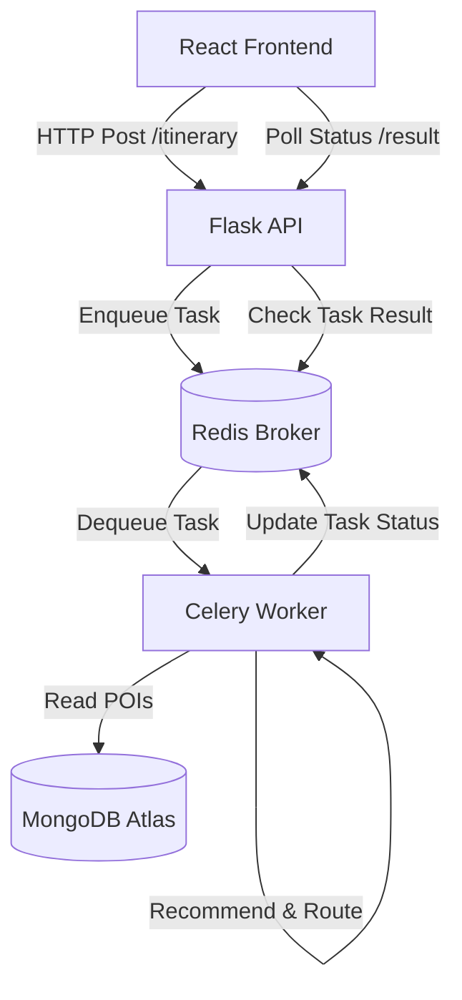

# Pathify Travel Recommender 🗺️

Pathify is a modern full-stack travel itinerary planner that generates personalized daily itineraries based on user interests, location data, and trip duration.

This project was built to demonstrate a scalable, production-grade architecture combining modern frontend frameworks, RESTful APIs, asynchronous background task processing, cache-backed message brokers, and lightweight machine learning recommendation engines.

---

## 🏗️ Architecture & Tech Stack

The system is split into decoupled layers to ensure horizontal scalability:



### 1. Frontend: **React + Vite**
* Built with modern React, utilizing hooks and state management to handle user forms and polling.
* Styled with clean, responsive custom CSS.
* Communicates with the Flask API asynchronously to trigger tasks and poll for status.

### 2. Backend API: **Flask (Python)**
* Provides REST endpoints to start itinerary generation (`POST /itinerary`) and query results (`GET /itinerary/result/<task_id>`).
* Relies on CORS configurations to securely share resources with the frontend.

### 3. Task Queue & Broker: **Celery + Redis**
* **Why Celery?** Heavy operations (such as scraping, complex routing, or heavy ML models) should not block the web server's request-response cycle. Celery processes these tasks in the background.
* **Why Redis?** Serves as a fast, in-memory message broker to coordinate tasks between the Flask app and Celery.

### 4. Database: **MongoDB Atlas**
* A NoSQL database storing Points of Interest (POIs) with detailed fields (name, tags, description, coordinate coordinates, and optimal duration).

### 5. Recommendation Engine: **Scikit-Learn & Pandas**
* Uses **TF-IDF Vectorization** and **Cosine Similarity** to compute compatibility scores between user-inputted interests and the POIs.
* Implements a greedy day-by-day pathing algorithm to schedule activities while respecting duration limits.

---

## 📊 Data & Scaling Disclaimer

* **Current State:** The application is seeded with a sample dataset of 50 major points of interest (POIs) in Mumbai.
* **Production Scaling:** This architecture is designed to scale. In a production environment, the recommendation algorithm can easily be extended to:
  * Integrate real-time APIs (e.g., Google Places, TripAdvisor, Yelp) for live POI discovery.
  * Incorporate real-time transit/traffic data (e.g., Google Directions API) to optimize routing times between locations.
  * Utilize more complex models, such as reinforcement learning or transformer-based sequence generators, for highly optimized route scheduling.

---

## 🚀 Running Locally

### Prerequisites
* Python 3.11+
* Node.js & npm
* Docker (for running Redis locally)

### 1. Database Setup
1. Create a free cluster on [MongoDB Atlas](https://www.mongodb.com/cloud/atlas).
2. Create a `.env` file in the `backend/` directory using this template:
   ```env
   MONGO_URI="your_mongodb_atlas_connection_string"
   MONGO_DB_NAME="travel-recommender"
   broker_url="redis://127.0.0.1:6379/0"
   result_backend="redis://127.0.0.1:6379/0"
   ```
3. Seed the database with the sample POIs:
   ```bash
   # Activate your virtual environment and run the loader script:
   # From root directory:
   .\venv\Scripts\python scripts/load_data.py
   ```

### 2. Run Redis Broker
Start Redis in docker:
```bash
docker run -d -p 6379:6379 redis
```

### 3. Run the Backend API & Worker
In one terminal window, start the Flask web server:
```bash
cd backend
..\venv\Scripts\python run.py
```

In a second terminal window, start the Celery background worker:
```bash
cd backend
# Windows requires -P eventlet or -P solo to avoid WinError 5 Permission errors:
..\venv\Scripts\celery -A celery_worker.celery worker --loglevel=info -P eventlet
```

### 4. Run the Frontend
Navigate to the `frontend/` directory, install dependencies, and start the development server:
```bash
cd frontend
npm install
npm run dev
```
Open `http://localhost:5173` in your browser.

---

## ☁️ Hosting in Production (100% Free Stack)

You can host this entire stack for **$0/month** by using the following configuration:

1. **Frontend:** Deploy the `frontend/` directory to **Vercel** or **Netlify** (Free static hosting). Set the environment variable `VITE_API_URL` to your production backend URL.
2. **Redis:** Create a free serverless Redis instance on **Upstash** (Free tier up to 10k commands/day). Replace the `broker_url` and `result_backend` in your `.env` with the Upstash connection URL.
3. **Database:** Keep using the free cluster on **MongoDB Atlas**.
4. **Backend (Flask + Celery):** Deploy the `backend/` directory to **Render** as a Free Web Service. 
   * To fit both Flask and Celery inside Render's free tier, set the Render start command to run our custom `start.sh` script:
     ```bash
     sh start.sh
     ```
   * The `start.sh` script spins up the Celery worker in the background using the resource-efficient `solo` pool, and runs Gunicorn for Flask in the foreground:
     ```bash
     # backend/start.sh
     celery -A celery_worker.celery worker --loglevel=info -P solo &
     gunicorn run:app --bind 0.0.0.0:$PORT
     ```
